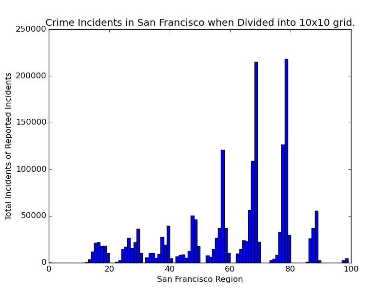
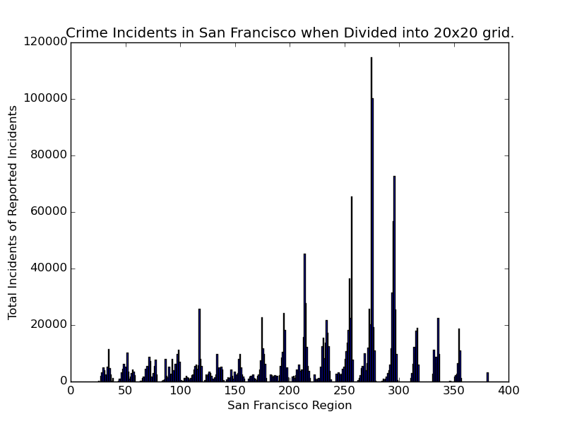
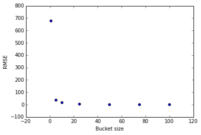
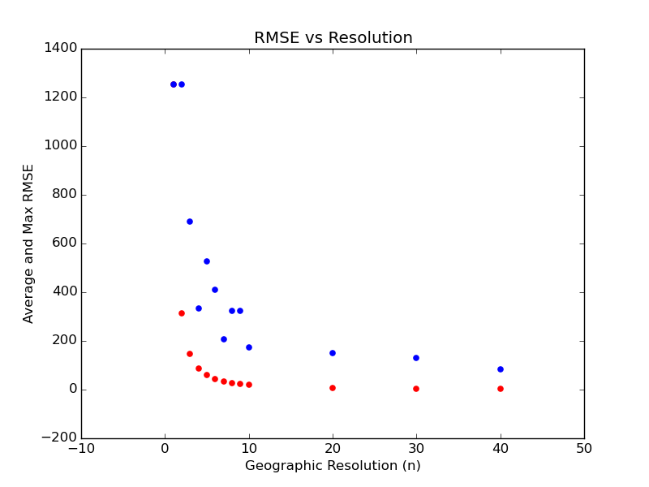

Crime Predictions
=================

Required Package(s)
================
Running the code in this repository requires the installation of:
    - numpy
    - matplotlib
    - seaborn
    - GPy
    - pandas
    - pickle

Problem Statement
=================

We are interested in applying machine learning methods to datasets
regarding crime (crime statistics in particular cities) and possible
related factors (such as tweet data, income, etc.). Specifically, we are
interested in investigating if it is possible to predict criminal events
for a specific time and place in the future (for example, assigning a
risk level for a shooting within the next week to different
neighborhoods).\

There is an abundance of data to incorporate into the model. Most
notably, numerous cities, such as Chicago [^1] and New York [^2], have
large datasets detailing crimes over the past decade. This data is
broken down into type of crime (e.g. theft, murder, narcotics, etc.),
time of day and year, geographic location, and more. Furthermore, cities
have released a myriad of other datasets that may possibly relate:
median income, location of police stations, etc [^3]. Combined with
possible other outside sources, such as geo-located Tweets [^4],
newspaper headlines, etc) there is a copious amount of data to engineer
features from and incorporate. This problem area is interesting because
of the dynamics that drive crime and the level of granularity needed.\

Furthermore, this problem area is useful and novel. Being able to
predict where crime will be most prevalent is of obvious benefit to a
city and its citizens. The police force could allocate more resources to
the predicted high-crime area in order to preempt criminal activity, and
citizens would be safer by knowing what parts of a city they should
avoid. However, in order to create actionable insights, the model
created needs to be able to predict crime within a small time frame, for
example around a day or week, and a small geographic region, e.g. a
block or a neighborhood.\

Having described the available data and the possible difficulties, we
can now refine the questions to investigate in this project. First and
foremost, we are interested in seeing if we can predict the criminal
incidents, perhaps for a specific type of crime, for a small time frame
and geographic region. Second, we are interested in learning which
features have the most predictive power with respect to crime. Having an
understanding of driving factors, cities can better work to mitigate the
risk factors for crime.

Approach
========

As a problem-driven project, a significant portion of this project will
include implementing various regressions algorithms. The first challenge
in this problem will be feature extraction. PCA and other methods to
analyze correlation between features we extract, as well as simple data
exploration methodologies (such as analyzing trends over-time, etc.)
will be helpful for feature prediction.\

For ML models, we will begin with simple linear regression (Bayesian) on
the features we ultimately extract. We expect numerous features, so we
will need to enforce sparsity via regularization or some form of
dimensionality reduction. Ultimately we would like to try to implement a
neural network, specifically a recurrent neural network, for practice
and to see if they lead to improved performance. Our understanding is
that RNNs are good for capturing patterns in time series data, which is
how this data is structured. In that case we would implement the neural
net in Torch. Beyond that, we will need to explore various other
regression models to determine what is appropriate for the data and
context. If time allows, we would also like to explore other models
typically good for time series data, such as Hidden Markov Models or
Gaussian Process, though we’re somewhat unfamiliar with both.\

In the end, we will likely need to develop a more sophisticated model
that more fully captures the dynamics of crime. For example, some
research has been done into the mutually excitatory nature of crime,
e.g. crime in one area causes surrounding areas to be more susceptible
to crime. These types of modeling enhancements may lead to better
predictive power. We expect to spend a good amount of time tweaking
different model ideas, and measuring their performance.

Evaluation
==========

The current standard in crime forecasting is hotspot mapping, the
process of mapping out occurrences of crime to identify high crime
areas. The thought, then, is that placing more officers or other
preventative resources in that areas with historically high rates of
crime will more significantly reduce crime. Though simple, in some
specific cases, this method had 90% accuracy when using the previous
year’s data to forecast the next year, according to one study. Combined
with the fact that hotspot mapping is easy to do with modern software
and easy to understand, it is certainly the baseline to beat.\

The metric we plan on using is root-mean-square error between the
predicted value and the true value for a given area. Since cities’ crime
data goes back over a decade, we plan on withholding a few years’ data
as a test set. The baseline machine learning algorithm will be simple
Bayesian regression on our selected feature space. We’re still in the
process of determining the evaluation plans for our more ambitious
models, such as a RNN or a HMM.\

There has been some work done already on this topic [^5] [^6], but not
much. We were able to find one review paper that detailed various
regression techniques employed already, including neural networks, but
many of these were dated before the release of these large datasets and
before the development of different flavors of neural nets. One recent
paper[^7] we looked at incorporating Tweets into a model and found
improvements, though they also did not incorporate all the data
available at the time, suggesting that there is ample room for
exploration in this domain.

Collaboration Plan
==================

The work primarily falls into two divisions: feature engineering and
machine learning. We both would like to do both aspects, so our plan is
to each code up different regression models and each engineer features
from different feature sets.

-   Feature extraction from data sets, with particular emphasis on
    newspaper headline extraction and data set merging (merge crime
    statistics with income, etc.). Models to test include Gausiann
    Process and Hidden Markov Models (for clustering).

-   Feature extraction, in particular time series-like features, with
    focus on specific types of crime. Likely to explore Bayesian linear
    regression, as well as RNN.

The code will be hosted publicly on gitHub (open source). The repo can
be found here:

[^1]: [City of Chicago Crime Dataset](https://data.cityofchicago.org/).
    For the full link, see https://data.cityofchicago.org/

[^2]: [New York Crime
    Data](https://nycopendata.socrata.com/Public-Safety/Historical-New-York-City-Crime-Data/hqhv-9zeg).
    For the full link, see
    https://nycopendata.socrata.com/Public-Safety/Historical-New-York-City-Crime-Data/hqhv-9zeg

[^3]: These data sets appear to all be released through the same
    platform: [https://www.data.gov/open-gov/](OpenData)

[^4]: [San Francisco Crime
    Mapping](https://data.sfgov.org/Public-Safety/Map-Crime-Incidents-from-1-Jan-2003/gxxq-x39z)
    -
    Link:https://data.sfgov.org/Public-Safety/Map-Crime-Incidents-from-1-Jan-2003/gxxq-x39z

[^5]: [A Novel Serial Crime Prediction Model Based on Bayesian Learning
    Theory
    ](http://ieeexplore.ieee.org.ezp-prod1.hul.harvard.edu/stamp/stamp.jsp?tp=&arnumber=5580971)

[^6]: [Once Upon a Crime: Towards Crime Prediction from Demographics and
    Mobile
    Data](http://delivery.acm.org.ezp-prod1.hul.harvard.edu/10.1145/2670000/2663254/p427-bogomolov.pdf?ip=128.103.149.52&id=2663254&acc=ACTIVE%20SERVICE&key=C82FBC3DCC335AD2%2E4D4702B0C3E38B35%2E4D4702B0C3E38B35%2E4D4702B0C3E38B35&CFID=553305163&CFTOKEN=20331583&__acm__=1444871399_feb25f6bb65f577ea58bb1f29f2f176a)

[^7]: [Automatic Crime Prediction Using Events Extracted from Twitter
    Posts](http://link.springer.com/chapter/10.1007/978-3-642-29047-3_28)

Abstract
======

Though average crime rates in the United States have been in the decline for the last few years , it is still useful to many groups, such as law enforcement, city officials, home buyers, etc., to be able to predict where and when crime will occur. We develop a model to predict future crime incidence at a future time given a geographical location, leveraging historical crime data from the cities of Boston, Chicago, and San Francisco. We take a Bayesian non-parametric approach to the problem of interpolation on crime data from these cities. We explore Gaussian Processes with simple closed form kernels which have proven effective at inferring CO2 levels . We compare these models to current baseline approaches which consists of linear regression on crime data, partitioned by region.

Proposal Modifications
======================

The largest modification between our project now and the proposal consists of dropping the requirement of implementing a neural network or a hidden markov model. Instead, we plan to focus primarily on Gaussian processes, and only considering other models if there is extra time to do so. The main reason for this change is the suggestion made by Finale, as well as the success of analytically solvable GPs in predicting time series data. Therefore, we expect to study variants of the standard covariance kernel for GPs, reporting the results of these models as applied across our three cities.

Another major modification to our proposal, and a concern noted in our original feedback, was simplification of the data sources we are drawing together. Previously we had noted that we would harness the full capacity of the open city data movement, by layer information about property values, community center locations, geo-located Tweets, etc. After a more thorough investigation of the data, we found this to be infeasible for many reasons, and we are focusing on the crime data itself. First, the data often was limited to only one year, while our crime data extended back several years, meaning that in order to incorporate other features, we would have to throw away a portion of our most relevant statistic, the crime data itself. Second, the data provided varied widely between cities. Though one city might provide information about property values, another city did not but provided information about police station locations instead. These inconsistencies made it difficult to apply our methods to multiple cities, something we found undesirable.

The baseline comparison remains linear regression, and we present those results below. We expect well implemented GPs to outperform the baseline, and GPs which take into account the interrelation between geographical regions to outperform all others.

Data Collection and Processing
==============================

We expect to explore three sets of data, all currently publicly available. These datasets mostly conform to the same standards, so the fields we seek to use are available across all these datasets

1.  [City of Chicago Crime Dataset](https://data.cityofchicago.org/Public-Safety/Crimes-2001-to-present/ijzp-q8t2?q=crime). The relevant data includes: longitude, latitude, time, date, and type of crime. The set contains a total of approximately 6 million records, dating back to 2001. We remove outliers in any of the above fields form the dataset.

2.  [San Francisco Crime Mapping](https://data.sfgov.org/Public-Safety/Map-Crime-Incidents-from-1-Jan-2003/gxxq-x39z): Again, the relevant data includes: longitude, latitude, time, date, and type of crime. In this data set, we also drop outliers. The total size is 1.8 million crime incidents.

3.  [Boston Crime Incident Reports](https://data.cityofboston.gov/Public-Safety/Crime-Incident-Reports/7cdf-6fgx): appoximately \(250,000\) entries after cleaning, dating back to 2012 to present.

The above data has been processed in a way that allows us to create \(n\times n\) time-series over \(n \times n\) discrete regions for each geographical city.

1.  The data is partitioned by region. We can imagine overlaying an \(n \times n\) grid on top of a city and then constructing a time series only from those values that occur within each grid square. We then attempt to run linear regression on each such time series.

2.  Time is discretized into a couple of columns to allow for variability that depends on more that just the overall trend in the data. However, we do merge the time into a single continuous variable which counts the number of minutes since the earliest data point.

    1.  We have a column specifying the month, for \(m \in [1,12] \cap \mathbb{Z}\), mapping \(1\) to January.

    2.  We have a column specifying the day of the month, for \(d \in [1,31] \cap \mathbb{Z}\).

    3.  We have a column specifying the year. The way this works is we specify the number of years since the earliest data point in our data set.

    The above information will be use as we attempt to discretize our time predictions further. The goal is to help create a system which can predict crime down to the month, week, or day if possible!

3.  In the end, we collect a total of \(n \times n\) time series. Each time series is consists of samples from our data set that accumulate the number of crimes in a given week per region. We therefore create a total of \(n \times n\) time series, each of length of up to \(12 \times 12\) points for the data sets.

We now present some figures to help us understand our data. Figure [fig:sf100] shows the histogram of the data for San Francisco when partitioned with \(n=10\).

 

We can explain the cyclic nature of the data extremely simply - most of the crime reported occurs in the central region of the city. The regions are numbered from the bottom right corner geographically, and continue westward until they fall outside the specified region, then moving upward to the next row. Therefore, we can imagine how moving in this fashion would lead to the above pattern in the data. Intuitively, however, we also have that most of the crime appears to occur in the northern region of San Francisco.

Baseline Data
=============

Boston
------

We now report some baselines results. We partition the city data into an \(n \times n\) grid for \(n \in [1, 5, 10, 25, 50, 75, 100]\). Then for each grid, we compute the number of crimes per month over the span of the entire dataset, approximately three years. We use a random \(80\%\) of the data for training ridge regression (due to the few data points:  36), and then compute the RMSE on the test set. We then average the RMSE over each square of the grid. Below we plot average RMSE over the entire grid vs \(n\):

Figure [fig:bosrmse] reveals a pathology in this method: the RMSE decreases towards 0 as we increase \(n\). We are creating smaller and smaller buckets, so that for large \(n\), each bucket contains only a few data points while most contain 0. The Boston dataset in particular contains  250,000 datapoints. Spread across the \(100 \times 100\) buckets per timeframe and \(36\) time frames means that by far most buckets have 0 crimes. Then the ridge regressor learns to predict 0 for most buckets, and gets a decent RMSE because even when there is a crime and it predicts 0, its error is small. Our hope is that Gaussian processes will not possess this pathology.

|:-----:|:--------------:|
| **n** |  **avg RMSE**  |
|   1   |  1254.35693616 |
|   5   |  36.8720866748 |
|   10  |  15.6527848706 |
|   25  |  3.55986509579 |
|   50  |  1.29333739045 |
|   75  |  0.72462817042 |
|  100  | 0.502453904579 |

San Francisco
-------------

The process is similar to that used with Boston, though we show results only for \(n \in [1,2,\cdots,10,20,\cdots,50]\). The testing data hold out is the most recent year. Data for San Francisco exists from early 2003, and we can see Figure [fig:sf100] for a distribution on the crime in the city.

|:-----:|:-------------:|
| **n** |  **avg RMSE** |
|   1   | 676.610276256 |
|   5   | 57.9066942345 |
|   10  |  18.802226607 |
|   20  |  7.0541635899 |
|   30  |  4.0393275858 |
|   40  |  2.7812162903 |

Future Work
===========

Our next step is fairly clear: begin exploring and understanding Gaussian processes.

One particular area of interests for us lies in exploring the city of Chicago. We’ve calculated baselines above for both Boston and San Francisco, so it shouldn’t be difficult to replicate our work for the Chicago crime data. The only small issue we have is that Chicago has significantly more data, on the order of magnitude of gigabytes. We expect that in order to process this dataset, we will need to either partition it by year, which would limit our ability to train a model over the entire dataset, or move onto a cloud-platform such as AWS, Microsoft Azure, or a Harvard cluster. Any feedback regarding the feasibility of the latter would be greatly appreciated.

